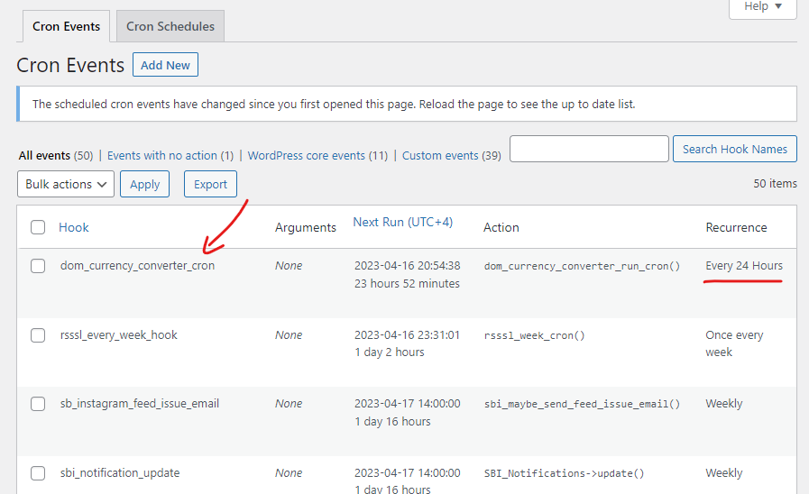

### DOM Currency Converter

WordPress Plugin, it will replace currency symbol & value with openexchangerates.org API currencies. I also created a cronjob that runs every day and updates the converted value in the.txt file.


> This plugin will change the USD symbol/value with AED symbol/value according to current rate of dollar. This plugin is for eagle booking.
> But you can modify DOM classes according to your theme and use this plugin.

#### API key
Place your API key in `$app_id`. I use openexchangerates.org API.
Simply signup on any exchange rate webapp, replace URL and API.

`$symbols` accepts multiple currencies with comma separated.

```php
$app_id = 'b143e2e376c14??????????????????';
$symbols = 'AED';
$base = 'USD';
$show_alternative = false;
$prettyprint = false;
$convert_amount = 1; // 1 USD is equal to AED?

$oxr_url = "https://openexchangerates.org/api/latest.json?app_id={$app_id}&base={$base}&symbols={$symbols}&prettyprint={$prettyprint}&show_alternative={$show_alternative}";

// Open CURL session:
$ch = curl_init();
curl_setopt($ch, CURLOPT_URL, $oxr_url);
curl_setopt($ch, CURLOPT_RETURNTRANSFER, true);
```

#### Plugin working
I developed DOM Currency Converter plugin. Because PayPal isn’t accept AED currency and we have no currency exchange functionality
This plugin will change the USD symbol/value with AED symbol/value according to current rate of dollar. This plugin is for eagle booking.
Exchange Rate API: openexchangerates.org  they provide 250 API request for currency exchange per month.
-   So, I set a daily cronjob (automation), it’ll hit API request on openexchangerate.org and fetch 1 USD is equal to AED on daily bases? So, we hit around 30 to 40 API request in a month.
-   How this plugin works.
    o   We add room prices in USD $.
    o   Plugin will convert USD and USD amount to AED on frontend. So, end user will see prices in AED and when he decided to pay the currency will be display in dollars so, PayPal and Strip both works.
    o   As I am saving converted amount in .text file, so I can get AED amount from that text file every time, And on next day automation execute and we’ll get updated USD amount and plugin save that amount in text and whole day we’ll use converted amount from that text file.
    o   On Book Online page we have Ajax based rooms listing, so using JavaScript plugin will update new listing’s currency/amount with converted amount I saved on that text file.
    o   All activity will be logged in logs.txt so, we can easily debug errors.
-   On deactivation plugin, cronjob (automation) will be removed. So, on that time no API trigger. And all listing prices will be displayed in USD symbol and amount.

#### Preview

USD to AED 


Automation (cronjob)


Log activity


Browser console logs


### Usage
This plugin manipulate DOM data with API data. In my case 
I target `price-currency` and `price-anoubt` wrapped in `room-price` and loop
on each and replace `USD symbol/amount` with `AED symbol/amount`.

You can modify DOM element in `dom-currency-converter.js` according to your requirements.
```html
<div>
    <div></div>
    <div></div>
    <div></div>
    <div class="room-price">
        <div>....</div>
        <div>....</div>
        <span class="normal-price">
        <span class="price-currency">USD</span>
        <span class="price-amount">14.00</span>
    </span>
        <span class="per-night-text">per day</span>
    </div>
    <div class="room-price">
        <div>....</div>
        <div>....</div>
        <span class="normal-price">
        <span class="price-currency">USD</span>
        <span class="price-amount">56.00</span>
    </span>
        <span class="per-night-text">per day</span>
    </div>
</div>
```

### Change cronjob interval
open `dom-currency-converter.php` in editor, find function `dom_currency_converter_cron_interval()`
and assign your custom time in seconds for `interval` key. 
```php
// Add custom interval of 1 minute
add_filter('cron_schedules', 'dom_currency_converter_cron_interval');
function dom_currency_converter_cron_interval($schedules)
{
    $schedules['myplugin_minute'] = array(
        'interval' => 86400, // 24 hours in seconds
        'display' => esc_html__('Every 24 Hours')
    );

    return $schedules;
}
```

### Activate and deactivate hooks
Activate and deactivate hooks are in `dom_currency_converter_activate.php`
```php
function dom_currency_converter_deactivate() {
    // Remove cron job on plugin deactivation
    wp_clear_scheduled_hook('dom_currency_converter_cron');

    // empty the contents of the file
    $file_path = plugin_dir_path( __FILE__ ) . 'logs.txt';
    $file = fopen( $file_path, 'a' );
    fwrite( $file, "\n--------------------\nplugin deactivate.\n" );
    fclose( $file );
}
register_activation_hook( __FILE__, 'dom_currency_converter_activate' );
register_deactivation_hook( __FILE__, 'dom_currency_converter_deactivate' );
```
____
____

#### In case you are using Zante Theme + Eagle Booking plugin then follow these steps
Activation
```text
1. Activate (DOM Currency Converter) plugin
2. Go to Eagle Booking > Settings > General Settings > Currency
3. Change AED to USD
4. And all rooms prices will be like USD20, and DOM Currency Converter will change these into AED74.
5. Because you are changing AED to USD in eagle booking then also change room prices by edit each room.
5i. Suppose your room price was AED74, and you change Eagle booking currency AED to USD
    then your listing price on frontend will be USD74 instead of AED74,
    So, edit that room and update price in USD. And rest to the USD to AED money exchange rate will be handle by
    DOM Currency Converter plugin.      
```


